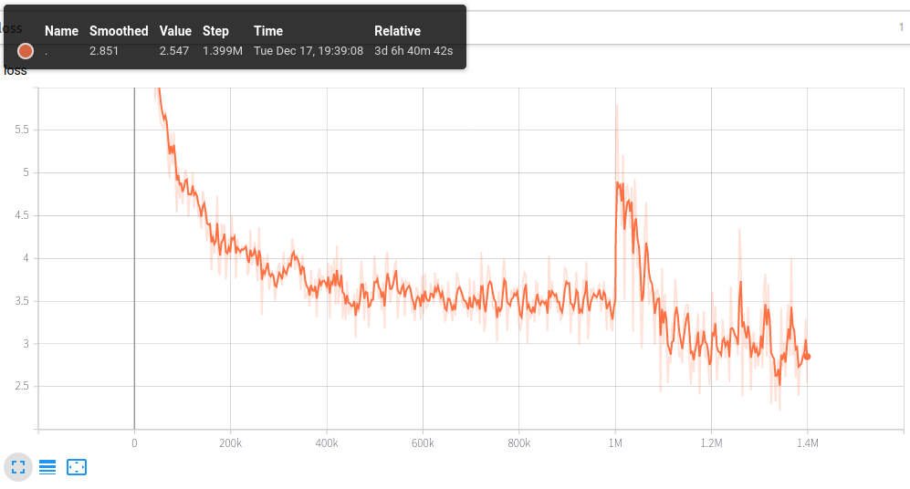

# ALBERT with SentencePiece for Japanese text.
This is a repository of Japanese ALBERT model with SentencePiece tokenizer.  
(Note: this project is a fork of [bert-japanese](https://github.com/yoheikikuta/bert-japanese))

To clone this repository together with the required
[ALBERT](https://github.com/jnory/ALBERT) (my fork of original [ALBERT](https://github.com/google-research/ALBERT)) and 
[WikiExtractor](https://github.com/attardi/wikiextractor):

    git clone --recurse-submodules https://github.com/jnory/albert-japanese

## Pretrained models
We provide pretrained BERT model and trained SentencePiece model for Japanese text.
Training data is the Japanese wikipedia corpus from [`Wikimedia Downloads`](https://dumps.wikimedia.org/).  
Please download all objects in the following google drive to `model/` directory.
- **[`Pretrained BERT model and trained SentencePiece model`](https://drive.google.com/drive/folders/1qvVrG4u8F94694zSExj8gWWoiAqyAlC2?usp=sharing)** 

Loss function during training is as below (after 1M steps the loss function massively changes because `max_seq_length` is changed from `128` to `512`.):


## Finetuning with BERT Japanese
We also provide a simple Japanese text classification problem with [`livedoor ニュースコーパス`](https://www.rondhuit.com/download.html).  
Try the following notebook to check the usability of finetuning.  
You can run the notebook on CPU (too slow) or GPU/TPU environments.
- **[finetune-to-livedoor-corpus.ipynb](https://github.com/yoheikikuta/bert-japanese/blob/master/notebook/finetune-to-livedoor-corpus.ipynb)**

The results are the following:
- ALBERT with SentencePiece
  ```
                        precision    recall  f1-score   support
  
  dokujo-tsushin       0.99      0.91      0.95       178
    it-life-hack       0.93      0.95      0.94       172
   kaden-channel       0.96      0.98      0.97       176
  livedoor-homme       0.83      0.86      0.85        95
     movie-enter       0.98      0.99      0.99       158
          peachy       0.91      0.93      0.92       174
            smax       0.98      0.96      0.97       167
    sports-watch       0.99      0.96      0.98       190
      topic-news       0.94      0.97      0.95       163
  
        accuracy                           0.95      1473
       macro avg       0.94      0.95      0.94      1473
    weighted avg       0.95      0.95      0.95      1473
  ```
- BERT with SentencePiece (from [original bert-japanese repository](https://github.com/yoheikikuta/bert-japanese#finetuning-with-bert-japanese))
  ```
                  precision    recall  f1-score   support

  dokujo-tsushin       0.98      0.94      0.96       178
    it-life-hack       0.96      0.97      0.96       172
   kaden-channel       0.99      0.98      0.99       176
  livedoor-homme       0.98      0.88      0.93        95
     movie-enter       0.96      0.99      0.98       158
          peachy       0.94      0.98      0.96       174
            smax       0.98      0.99      0.99       167
    sports-watch       0.98      1.00      0.99       190
      topic-news       0.99      0.98      0.98       163

       micro avg       0.97      0.97      0.97      1473
       macro avg       0.97      0.97      0.97      1473
    weighted avg       0.97      0.97      0.97      1473
  ```

## Pretraining from scratch
All scripts for pretraining from scratch are provided.
Follow the instructions below.

### Data preparation
Data downloading and preprocessing.

```
python3 src/data-download-and-extract.py
bash src/file-preprocessing.sh
```

The above scripts use the latest jawiki data and wikiextractor module, which are different from those used for the pretrained model.
If you wanna prepare the same situation, use the following information:

- albert-japanese: commit `de548d2cfdf1ca90a7872248e4b2adf98527da3e`
- dataset: `jawiki-20191201-pages-articles-multistream.xml.bz2` in the [Google Drive](https://drive.google.com/drive/folders/1qvVrG4u8F94694zSExj8gWWoiAqyAlC2?usp=sharing)
- wikiextractor: commit `3162bb6c3c9ebd2d15be507aa11d6fa818a454ac`

### Training SentencePiece model
Train a SentencePiece model using the preprocessed data.

```
python3 src/train-sentencepiece.py
```

### Creating data for pretraining
Create .tfrecord files for pretraining.

```
bash src/run_create_pretraining_data.sh [extract_dir] [max_seq_length]
```

`extract_dir` is a base directory to which the wikipedia texts are extracted, and,  
`max_seq_length` need to be 128 and 512

### Pretraining
You need GPU/TPU environment to pretrain a BERT model.  
The following notebook provides the link to Colab notebook where you can run the scripts with TPUs.

- **[pretraining.ipynb](https://github.com/jnory/albert-japanese/blob/master/notebook/pretraining.ipynb)**
